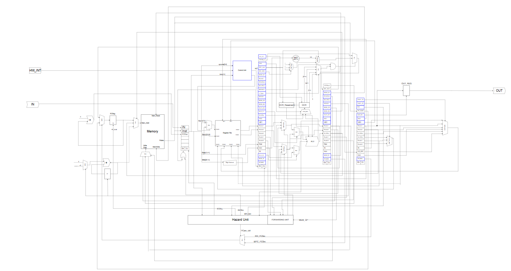

# 5-Stage Pipelined Von-Neumann Processor

A comprehensive hardware implementation of a 32-bit pipelined processor in VHDL. This project demonstrates a full-stack CPU design, including a custom Instruction Set Architecture (ISA), hazard management, and a dedicated assembler.

## 🏗️ Project Structure

The repository is organized into modular components that reflect the physical hardware layout:

* **`/processor`**: The top-level entity that integrates all sub-modules into the final system.
* **`/pipelined_registers`**: Contains the physical registers (IF/ID, ID/EX, EX/MEM, MEM/WB) that separate the pipeline stages.
* **`/decode`**: Handles instruction decoding, register file access (R0-R7), and control signal generation.
* **`/forwarding_unit`**: Logic to resolve RAW (Read-After-Write) data hazards by routing data between stages.
* **`/Hazard_detection_unit`**: Manages pipeline stalls and flushes for control hazards and branch prediction.
* **`/memory`**: A unified 1MB RAM for both instructions and data, following the Von-Neumann architecture.
* **`/sign_extender`**: Expands 16-bit immediates and offsets to 32-bit values for the ALU.
* **`/assembler`**: A Python-based tool that converts assembly code into machine-readable memory files.

---

## 🚀 Processor Specifications

* **Architecture**: 5-Stage Pipeline (Fetch, Decode, Execute, Memory, Write-back).
* **Word Size**: 32-bit data bus and 32-bit registers.
* **Memory**: 1 MB address space of 32-bit width.
* **ISA Support**: 
    * **Arithmetic/Logic**: ADD, SUB, AND, NOT, INC.
    * **Data Movement**: MOV, SWAP, LDM, LDD, STD.
    * **Stack**: PUSH, POP.
    * **Control Flow**: JZ, JN, JC, JMP, CALL, RET, RTI.
* **Interrupts**: Supports non-maskable interrupts (INTR) with state preservation on the stack.

---

## 📊 Synthesis Results

This project was synthesized targeting an FPGA to verify hardware resource utilization and timing constraints.

### RTL Schematic

*Note: The image above shows the gate-level interconnection of the 5-stage pipeline.*
---

## 🛠️ How to Use

1.  **Generate Machine Code**:
    Run the assembler on your `.asm` file to create a memory initialization file.
2.  **Simulation**:
    Load the design into ModelSim or QuestaSim using the provided testbenches.
3.  **Synthesis**:
    Open the project in Quartus or Vivado, assign pins, and run the compilation to view the synthesis reports.

---

## 🤝 Contributors
* **Alaa Haytham** - [GitHub](https://github.com/AlaaHaytham58)
* **Razan Meghaed** - [GitHub](https://github.com/Razan175)
* **Abd El-Rahman Hayder** - [GitHub](https://github.com/QuantumHayder)
* **Abde EL-Rahman Zakaria** - [GitHub](https://github.com/Abdelrahman-Zaka)
